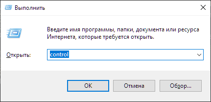
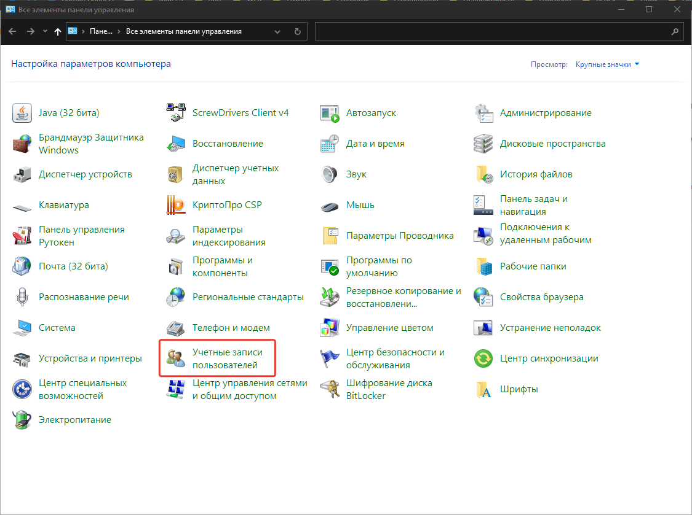
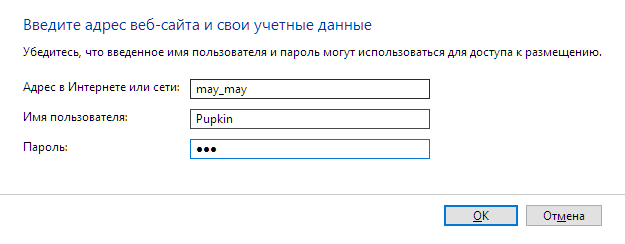

Для безопасного хранения паролей в Windows использую Windows Credential Locker.

Покажу на примере:

## Добавляем пароль

Зайдем в панель управления `Пуск -> Панель управления или`

```bash
win + r
```

Набираем `control` и нажимаем `ok`



И переходим в `Учетные данные пользователей`



Далее `Администрирование учетных данных`


И кликаем на `Добавить общие учетные данные`


Заполняем поля



## Получаем пароль в скрипте python

```python
login = "Pupkin"
pwd = keyring.get_password("may_may", login)
```

Если пароль не найден вернет `None`

О том, зачем мне это понадобилось в [статье](/posts/rpa/1С_schedule_start_stop_run_epf)
